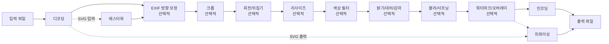
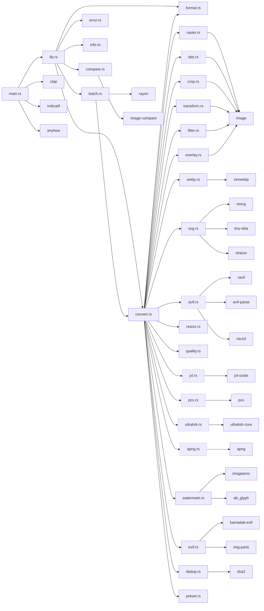
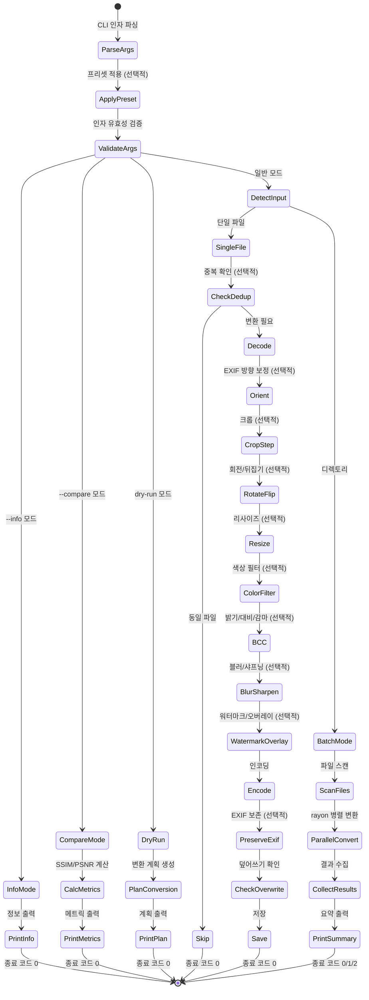

# imgconv 설계 문서

## 개요

imgconv는 Rust로 작성된 고성능 이미지 포맷 변환 및 처리 CLI 도구이다. 라이브러리 크레이트(`lib.rs`)와 바이너리 크레이트(`main.rs`)로 분리되어, CLI 도구로 사용하거나 다른 Rust 프로젝트에서 라이브러리로 재사용할 수 있다.

핵심 설계 원칙:

- **Pure Rust**: 모든 의존성이 Rust로 구현되어 C 컴파일러 없이 빌드 가능
- **모듈화**: 포맷별 변환 로직, 이미지 처리, 리사이즈, 품질 제어, 배치 처리 등이 독립 모듈로 분리
- **병렬 처리**: rayon 기반 병렬 배치 변환으로 대량 파일 처리 성능 확보
- **선택적 기능**: AVIF, JXL, DDS, PCX, Ultra HDR, APNG 지원을 Cargo feature flag로 분리하여 빌드 최적화
- **파이프라인 처리**: EXIF 방향 보정 → 크롭 → 회전/뒤집기 → 리사이즈 → 색상 필터 → 밝기/대비/감마 → 블러/샤프닝 → 워터마크/오버레이 → 인코딩 순서의 이미지 처리 파이프라인

### 기술 스택

| 영역 | 크레이트 | 용도 |
|------|---------|------|
| CLI 파싱 | clap (derive) | 커맨드라인 인자 파싱 |
| 래스터 이미지 | image v0.25 | 래스터 포맷 읽기/쓰기 |
| WebP | zenwebp v0.2 | WebP 인코딩/디코딩 (lossy/lossless) |
| SVG 래스터화 | resvg + tiny-skia | SVG → 래스터 변환 |
| SVG 트레이싱 | vtracer | 래스터 → SVG 변환 |
| 병렬 처리 | rayon | 디렉토리 일괄 변환 병렬화 |
| 진행률 | indicatif | 터미널 진행률 바 |
| 에러 (앱) | anyhow | 바이너리 크레이트 에러 처리 |
| 에러 (라이브러리) | thiserror | 라이브러리 크레이트 에러 타입 |
| AVIF 인코딩 | ravif (optional) | AVIF 인코딩 (rav1e 기반) |
| AVIF 디코딩 | avif-parse + rav1d (optional) | AVIF 디코딩 |
| JPEG XL 디코딩 | jxl-oxide (optional) | JPEG XL 디코딩 (읽기 전용) |
| DDS 디코딩 | image (dds feature, optional) | DDS 디코딩 (읽기 전용) |
| PCX 코덱 | pcx (optional) | PCX 읽기/쓰기 |
| Ultra HDR | ultrahdr-core (optional) | Ultra HDR JPEG 읽기/쓰기 |
| APNG | apng (optional) | APNG 인코딩 |
| 이미지 처리 | imageproc | 텍스트 워터마크 렌더링 |
| 폰트 렌더링 | ab_glyph | TrueType 폰트 로딩/렌더링 |
| EXIF 읽기 | kamadak-exif | EXIF 메타데이터 읽기 |
| EXIF 쓰기 | img-parts | EXIF 메타데이터 복사/기록 |
| 이미지 비교 | image-compare | SSIM/PSNR 메트릭 계산 |
| 해시 | sha2 | SHA-256 파일 해시 비교 |

## 아키텍처

### 전체 구조

```mermaid
graph TD
    subgraph "바이너리 크레이트 (main.rs)"
        CLI[CLI 파서<br/>clap derive]
        PR[Progress Reporter<br/>indicatif]
        EXIT[Exit Code Handler]
    end

    subgraph "라이브러리 크레이트 (lib.rs)"
        CONV[Converter<br/>변환 오케스트레이터]
        FMT[Format Module<br/>포맷 감지/변환]
        RASTER[Raster Codec<br/>image 크레이트]
        WEBP[WebP Codec<br/>zenwebp]
        SVG_R[SVG Rasterizer<br/>resvg + tiny-skia]
        SVG_T[SVG Tracer<br/>vtracer]
        AVIF_C[AVIF Codec<br/>ravif + rav1d]
        JXL_C[JXL Decoder<br/>jxl-oxide]
        DDS_C[DDS Decoder<br/>image dds]
        PCX_C[PCX Codec<br/>pcx]
        UHDR_C[UltraHDR Codec<br/>ultrahdr-core]
        APNG_C[APNG Codec<br/>image + apng]
        RESIZE[Resizer<br/>image 크레이트]
        QUALITY[Quality Controller]
        BATCH[Batch Processor<br/>rayon]
        CROP[Cropper<br/>image crop_imm]
        TRANSFORM[Transformer<br/>회전/뒤집기]
        FILTER[Filter<br/>색상/블러/밝기]
        WATERMARK[Watermarker<br/>imageproc + ab_glyph]
        OVERLAY[Overlay Composer<br/>image overlay]
        EXIF[EXIF Handler<br/>kamadak-exif + img-parts]
        INFO[Info Reporter]
        COMPARE[Image Comparator<br/>image-compare]
        DEDUP[Dedup Checker<br/>sha2]
        PRESET[Preset Manager]
    end

    CLI --> CONV
    CLI --> PR
    CLI --> EXIT
    CLI --> INFO
    CLI --> COMPARE
    CONV --> FMT
    FMT --> RASTER
    FMT --> WEBP
    FMT --> SVG_R
    FMT --> SVG_T
    FMT --> AVIF_C
    FMT --> JXL_C
    FMT --> DDS_C
    FMT --> PCX_C
    FMT --> UHDR_C
    FMT --> APNG_C
    CONV --> EXIF
    CONV --> CROP
    CONV --> TRANSFORM
    CONV --> RESIZE
    CONV --> FILTER
    CONV --> WATERMARK
    CONV --> OVERLAY
    CONV --> QUALITY
    CONV --> BATCH
    CONV --> DEDUP
    CONV --> PRESET
    BATCH --> CONV

    style AVIF_C stroke-dasharray: 5 5
    style JXL_C stroke-dasharray: 5 5
    style DDS_C stroke-dasharray: 5 5
    style PCX_C stroke-dasharray: 5 5
    style UHDR_C stroke-dasharray: 5 5
    style APNG_C stroke-dasharray: 5 5
```



### 변환 파이프라인



이미지 처리 파이프라인 순서 (엄격히 준수):

1. 입력 파일 포맷 감지 (확장자 기반)
2. 포맷별 디코더로 이미지 디코딩 → `DynamicImage`
3. EXIF 방향 보정 (`--auto-orient` 지정 시)
4. 크롭 (`--crop` 지정 시)
5. 회전/뒤집기 (`--rotate`, `--flip` 지정 시)
6. 리사이즈 (`--width`, `--height` 지정 시)
7. 색상 필터 (`--grayscale`, `--invert`, `--sepia` 지정 시)
8. 밝기/대비/감마 (`--brightness`, `--contrast`, `--gamma` 지정 시)
9. 블러/샤프닝 (`--blur`, `--sharpen` 지정 시)
10. 워터마크/오버레이 (`--watermark`, `--overlay` 지정 시)
11. 대상 포맷 인코더로 인코딩 (품질 설정 적용)
12. EXIF 보존 (`--preserve-exif` 지정 시)
13. 출력 파일 저장

SVG 관련 특수 경로:

- SVG → 래스터: resvg로 래스터화 후 `DynamicImage`로 변환, 이후 파이프라인 진행
- 래스터 → SVG: 파이프라인 처리 후 vtracer로 트레이싱하여 SVG 문자열 생성

## 컴포넌트 및 인터페이스

### 크레이트 구조

```text
imgconv/
├── Cargo.toml
├── src/
│   ├── lib.rs          # 라이브러리 진입점, 공개 API
│   ├── main.rs         # CLI 바이너리 진입점
│   ├── format.rs       # 포맷 감지 및 열거형
│   ├── convert.rs      # 변환 오케스트레이터
│   ├── raster.rs       # 래스터 포맷 인코딩/디코딩
│   ├── webp.rs         # WebP 인코딩/디코딩
│   ├── svg.rs          # SVG 래스터화/트레이싱
│   ├── avif.rs         # AVIF 인코딩/디코딩 (feature-gated)
│   ├── jxl.rs          # JPEG XL 디코딩 (feature-gated)
│   ├── dds.rs          # DDS 읽기 (feature-gated)
│   ├── pcx.rs          # PCX 읽기/쓰기 (feature-gated)
│   ├── ultrahdr.rs     # Ultra HDR JPEG 읽기/쓰기 (feature-gated)
│   ├── apng.rs         # APNG 읽기/쓰기 (feature-gated)
│   ├── resize.rs       # 이미지 리사이즈
│   ├── quality.rs      # 품질 설정 관리
│   ├── batch.rs        # 배치 처리
│   ├── crop.rs         # 이미지 크롭
│   ├── transform.rs    # 회전/뒤집기
│   ├── filter.rs       # 색상 필터, 블러/샤프닝, 밝기/대비/감마
│   ├── watermark.rs    # 텍스트 워터마크
│   ├── overlay.rs      # 이미지 오버레이
│   ├── exif.rs         # EXIF 방향 보정 + EXIF 보존
│   ├── info.rs         # 이미지 정보 출력
│   ├── compare.rs      # 이미지 품질 비교
│   ├── dedup.rs        # 중복 건너뛰기
│   ├── preset.rs       # 변환 프리셋
│   └── error.rs        # 라이브러리 에러 타입
```

### 핵심 인터페이스

#### `ImageFormat` 열거형 (format.rs)

```rust
/// 지원하는 모든 이미지 포맷
#[derive(Debug, Clone, Copy, PartialEq, Eq, Hash)]
pub enum ImageFormat {
    Jpeg,
    Png,
    Gif,
    Bmp,
    Tiff,
    Tga,
    Ico,
    Qoi,
    Pnm,
    OpenExr,
    Hdr,
    Farbfeld,
    WebP,
    Svg,
    #[cfg(feature = "avif")]
    Avif,
    #[cfg(feature = "jxl")]
    Jxl,
    #[cfg(feature = "dds")]
    Dds,
    #[cfg(feature = "pcx")]
    Pcx,
    #[cfg(feature = "ultrahdr")]
    UltraHdr,
    #[cfg(feature = "apng")]
    Apng,
}

impl ImageFormat {
    /// 파일 확장자로부터 포맷 감지
    pub fn from_extension(ext: &str) -> Result<Self, ConvertError>;

    /// 포맷에 해당하는 기본 확장자 반환
    pub fn extension(&self) -> &'static str;

    /// 손실 압축을 지원하는 포맷인지 확인
    pub fn supports_quality(&self) -> bool;

    /// 쓰기를 지원하는 포맷인지 확인
    pub fn supports_write(&self) -> bool;

    /// 지원되는 모든 확장자 목록 반환
    pub fn supported_extensions() -> &'static [&'static str];
}
```

#### `ConvertOptions` 구조체 (convert.rs)

```rust
/// 변환 옵션
#[derive(Debug, Clone)]
pub struct ConvertOptions {
    /// 대상 포맷 (쉼표 구분 시 여러 포맷)
    pub target_formats: Vec<ImageFormat>,
    /// 품질 설정 (1-100, None이면 포맷별 기본값)
    pub quality: Option<u8>,
    /// 리사이즈 옵션
    pub resize: Option<ResizeOptions>,
    /// 크롭 옵션
    pub crop: Option<CropOptions>,
    /// 회전 옵션
    pub rotate: Option<RotateAngle>,
    /// 뒤집기 옵션
    pub flip: Option<FlipDirection>,
    /// 색상 필터 옵션
    pub color_filter: ColorFilterOptions,
    /// 밝기/대비/감마 옵션
    pub brightness_contrast: BrightnessContrastOptions,
    /// 블러 옵션 (sigma 값)
    pub blur: Option<f32>,
    /// 샤프닝 옵션 (값)
    pub sharpen: Option<f32>,
    /// 텍스트 워터마크 옵션
    pub watermark: Option<WatermarkOptions>,
    /// 이미지 오버레이 옵션
    pub overlay: Option<OverlayOptions>,
    /// EXIF 자동 방향 보정
    pub auto_orient: bool,
    /// EXIF 메타데이터 보존
    pub preserve_exif: bool,
    /// WebP 인코딩 모드
    pub webp_mode: WebPMode,
    /// SVG 관련 옵션
    pub svg_options: SvgOptions,
    /// 출력 디렉토리 (None이면 입력 파일과 동일 디렉토리)
    pub output_dir: Option<PathBuf>,
    /// 기존 파일 덮어쓰기 허용
    pub overwrite: bool,
    /// 중복 파일 건너뛰기
    pub skip_identical: bool,
    /// dry-run 모드
    pub dry_run: bool,
    /// 상세 로그 출력
    pub verbose: bool,
}
```

#### `CropOptions` 구조체 (crop.rs)

```rust
/// 크롭 옵션
#[derive(Debug, Clone, Copy)]
pub struct CropOptions {
    /// 시작 X 좌표
    pub x: u32,
    /// 시작 Y 좌표
    pub y: u32,
    /// 크롭 너비
    pub width: u32,
    /// 크롭 높이
    pub height: u32,
}

impl CropOptions {
    /// "x,y,w,h" 형식의 문자열을 파싱
    pub fn from_str(s: &str) -> Result<Self, ConvertError>;

    /// 이미지 크기에 대해 크롭 영역이 유효한지 검증
    pub fn validate(&self, image_width: u32, image_height: u32) -> Result<(), ConvertError>;
}

/// 이미지에 크롭을 적용
pub fn apply_crop(img: &DynamicImage, options: &CropOptions) -> Result<DynamicImage, ConvertError>;
```

#### `RotateAngle` 및 `FlipDirection` 열거형 (transform.rs)

```rust
/// 회전 각도
#[derive(Debug, Clone, Copy, PartialEq, Eq)]
pub enum RotateAngle {
    Rotate90,
    Rotate180,
    Rotate270,
}

/// 뒤집기 방향
#[derive(Debug, Clone, Copy, PartialEq, Eq)]
pub enum FlipDirection {
    Horizontal,
    Vertical,
}

/// 이미지에 회전을 적용
pub fn apply_rotate(img: &DynamicImage, angle: RotateAngle) -> DynamicImage;

/// 이미지에 뒤집기를 적용
pub fn apply_flip(img: &DynamicImage, direction: FlipDirection) -> DynamicImage;
```

#### `ColorFilterOptions` 구조체 및 필터 함수 (filter.rs)

```rust
/// 색상 필터 옵션
#[derive(Debug, Clone, Copy, Default)]
pub struct ColorFilterOptions {
    pub grayscale: bool,
    pub invert: bool,
    pub sepia: bool,
}

/// 밝기/대비/감마 옵션
#[derive(Debug, Clone, Copy, Default)]
pub struct BrightnessContrastOptions {
    /// 밝기 조정 (양수: 밝게, 음수: 어둡게)
    pub brightness: Option<i32>,
    /// 대비 조정
    pub contrast: Option<f32>,
    /// 감마 보정 (양수만 허용)
    pub gamma: Option<f32>,
}

/// 색상 필터 적용 (grayscale → sepia → invert 순서)
pub fn apply_color_filters(img: &DynamicImage, options: &ColorFilterOptions) -> DynamicImage;

/// 밝기/대비/감마 적용 (brightness → contrast → gamma 순서)
pub fn apply_brightness_contrast(
    img: &DynamicImage,
    options: &BrightnessContrastOptions,
) -> DynamicImage;

/// 가우시안 블러 적용
pub fn apply_blur(img: &DynamicImage, sigma: f32) -> DynamicImage;

/// 언샤프 마스크 적용
pub fn apply_sharpen(img: &DynamicImage, value: f32) -> DynamicImage;
```

#### `WatermarkOptions` 구조체 (watermark.rs)

```rust
/// 워터마크 위치
#[derive(Debug, Clone, Copy, PartialEq, Eq)]
pub enum Position {
    TopLeft,
    TopRight,
    BottomLeft,
    BottomRight,
    Center,
}

impl Default for Position {
    fn default() -> Self { Self::BottomRight }
}

/// 텍스트 워터마크 옵션
#[derive(Debug, Clone)]
pub struct WatermarkOptions {
    /// 워터마크 텍스트
    pub text: String,
    /// 배치 위치 (기본: bottom-right)
    pub position: Position,
    /// 투명도 (0.0-1.0, 기본: 0.5)
    pub opacity: f32,
    /// 폰트 파일 경로 (None이면 내장 기본 폰트)
    pub font_path: Option<PathBuf>,
}

/// 이미지에 텍스트 워터마크 적용
pub fn apply_watermark(
    img: &DynamicImage,
    options: &WatermarkOptions,
) -> Result<DynamicImage, ConvertError>;
```

#### `OverlayOptions` 구조체 (overlay.rs)

```rust
/// 이미지 오버레이 옵션
#[derive(Debug, Clone)]
pub struct OverlayOptions {
    /// 오버레이 이미지 파일 경로
    pub image_path: PathBuf,
    /// 배치 위치 (기본: bottom-right)
    pub position: Position,
    /// 투명도 (0.0-1.0, 기본: 1.0)
    pub opacity: f32,
}

/// 이미지에 오버레이 적용
pub fn apply_overlay(
    img: &DynamicImage,
    options: &OverlayOptions,
) -> Result<DynamicImage, ConvertError>;
```

#### EXIF 처리 (exif.rs)

```rust
/// EXIF Orientation 태그 값
#[derive(Debug, Clone, Copy, PartialEq, Eq)]
pub enum ExifOrientation {
    Normal,           // 1
    FlipHorizontal,   // 2
    Rotate180,        // 3
    FlipVertical,     // 4
    Transpose,        // 5
    Rotate90,         // 6
    Transverse,       // 7
    Rotate270,        // 8
}

/// EXIF Orientation 태그를 읽어 이미지 방향 보정
pub fn auto_orient(img: &DynamicImage, input_path: &Path) -> Result<DynamicImage, ConvertError>;

/// 원본 파일의 EXIF 메타데이터를 변환 결과 파일에 복사
pub fn preserve_exif(
    source_path: &Path,
    dest_path: &Path,
) -> Result<(), ConvertError>;
```

#### 이미지 정보 출력 (info.rs)

```rust
/// 이미지 메타데이터 정보
#[derive(Debug)]
pub struct ImageInfo {
    pub width: u32,
    pub height: u32,
    pub format: ImageFormat,
    pub color_type: String,
    pub bit_depth: u8,
    pub file_size: u64,
    pub exif_summary: Option<ExifSummary>,
}

/// EXIF 요약 정보
#[derive(Debug)]
pub struct ExifSummary {
    pub camera_model: Option<String>,
    pub date_taken: Option<String>,
    pub iso: Option<u32>,
    pub shutter_speed: Option<String>,
    pub aperture: Option<String>,
}

/// 이미지 파일의 메타데이터를 읽어 반환
pub fn get_image_info(path: &Path) -> Result<ImageInfo, ConvertError>;

/// 디렉토리 내 모든 이미지 파일의 정보를 반환
pub fn get_directory_info(dir: &Path) -> Result<Vec<(PathBuf, ImageInfo)>, ConvertError>;
```

#### 이미지 품질 비교 (compare.rs)

```rust
/// 이미지 비교 결과
#[derive(Debug)]
pub struct CompareResult {
    pub ssim: f64,
    pub psnr: f64,
}

/// 두 이미지 간 SSIM 및 PSNR 메트릭 계산
pub fn compare_images(
    path_a: &Path,
    path_b: &Path,
) -> Result<CompareResult, ConvertError>;
```

#### 중복 건너뛰기 (dedup.rs)

```rust
/// 파일의 SHA-256 해시 계산
pub fn file_hash(path: &Path) -> Result<String, ConvertError>;

/// 두 파일의 해시를 비교하여 동일 여부 반환
pub fn is_identical(path_a: &Path, path_b: &Path) -> Result<bool, ConvertError>;
```

#### 변환 프리셋 (preset.rs)

```rust
/// 프리셋 종류
#[derive(Debug, Clone, Copy, PartialEq, Eq)]
pub enum Preset {
    Web,
    Thumbnail,
    Print,
    Social,
}

impl Preset {
    /// 문자열로부터 프리셋 파싱
    pub fn from_str(s: &str) -> Result<Self, ConvertError>;
}

/// 프리셋 설정
#[derive(Debug, Clone)]
pub struct PresetConfig {
    pub format: ImageFormat,
    pub quality: Option<u8>,
    pub width: Option<u32>,
    pub height: Option<u32>,
    pub keep_aspect: bool,
    pub webp_mode: Option<WebPMode>,
    pub dpi: Option<f32>,
}

/// 프리셋에 해당하는 설정 반환
pub fn get_preset_config(preset: Preset) -> PresetConfig;

/// 프리셋 설정을 ConvertOptions에 적용 (개별 옵션이 프리셋을 덮어씀)
pub fn apply_preset(
    preset: Preset,
    options: &mut ConvertOptions,
);
```

#### Feature-Gated 포맷 코덱

##### JPEG XL 디코더 (jxl.rs)

```rust
/// JPEG XL 파일을 디코딩하여 DynamicImage로 반환 (읽기 전용)
#[cfg(feature = "jxl")]
pub fn decode_jxl(path: &Path) -> Result<DynamicImage, ConvertError>;
```

##### DDS 디코더 (dds.rs)

```rust
/// DDS 파일을 디코딩하여 DynamicImage로 반환 (읽기 전용)
#[cfg(feature = "dds")]
pub fn decode_dds(path: &Path) -> Result<DynamicImage, ConvertError>;
```

##### PCX 코덱 (pcx.rs)

```rust
/// PCX 파일을 디코딩하여 DynamicImage로 반환
#[cfg(feature = "pcx")]
pub fn decode_pcx(path: &Path) -> Result<DynamicImage, ConvertError>;

/// DynamicImage를 PCX 포맷으로 인코딩하여 저장
#[cfg(feature = "pcx")]
pub fn encode_pcx(img: &DynamicImage, output: &Path) -> Result<(), ConvertError>;
```

##### Ultra HDR 코덱 (ultrahdr.rs)

```rust
/// Ultra HDR JPEG 파일을 디코딩하여 DynamicImage로 반환
#[cfg(feature = "ultrahdr")]
pub fn decode_ultrahdr(path: &Path) -> Result<DynamicImage, ConvertError>;

/// DynamicImage를 Ultra HDR JPEG 포맷으로 인코딩하여 저장
#[cfg(feature = "ultrahdr")]
pub fn encode_ultrahdr(img: &DynamicImage, output: &Path) -> Result<(), ConvertError>;
```

##### APNG 코덱 (apng.rs)

```rust
/// APNG 파일의 첫 번째 프레임을 디코딩하여 DynamicImage로 반환
#[cfg(feature = "apng")]
pub fn decode_apng(path: &Path) -> Result<DynamicImage, ConvertError>;

/// DynamicImage를 APNG 포맷으로 인코딩하여 저장 (단일 프레임)
#[cfg(feature = "apng")]
pub fn encode_apng(img: &DynamicImage, output: &Path) -> Result<(), ConvertError>;
```

#### `ResizeOptions` 구조체 (resize.rs)

```rust
#[derive(Debug, Clone)]
pub struct ResizeOptions {
    pub width: Option<u32>,
    pub height: Option<u32>,
    pub keep_aspect: bool,
}
```

#### `SvgOptions` 구조체 (svg.rs)

```rust
#[derive(Debug, Clone)]
pub struct SvgOptions {
    /// SVG 래스터화 DPI (기본값: 96)
    pub dpi: f32,
    /// SVG 트레이싱 프리셋
    pub preset: SvgPreset,
}

#[derive(Debug, Clone, Copy, PartialEq, Eq)]
pub enum SvgPreset {
    Default,
    Bw,
    Poster,
    Photo,
}
```

#### `WebPMode` 열거형 (webp.rs)

```rust
#[derive(Debug, Clone, Copy, PartialEq, Eq)]
pub enum WebPMode {
    /// Lossy 인코딩 (기본값)
    Lossy,
    /// Lossless 인코딩
    Lossless,
}

impl Default for WebPMode {
    fn default() -> Self { Self::Lossy }
}
```

#### `Converter` (convert.rs)

```rust
/// 단일 파일 변환 수행
pub fn convert_file(
    input: &Path,
    options: &ConvertOptions,
) -> Result<Vec<ConvertResult>, ConvertError>;

/// 변환 계획 생성 (dry-run용)
pub fn plan_conversion(
    input: &Path,
    options: &ConvertOptions,
) -> Result<Vec<ConversionPlan>, ConvertError>;
```

#### `BatchProcessor` (batch.rs)

```rust
/// 배치 변환 결과
#[derive(Debug)]
pub struct BatchResult {
    pub succeeded: Vec<ConvertResult>,
    pub failed: Vec<(PathBuf, ConvertError)>,
    pub skipped: Vec<(PathBuf, String)>,
}

/// 디렉토리 내 모든 이미지 파일을 병렬 변환
pub fn convert_directory(
    dir: &Path,
    options: &ConvertOptions,
    progress: Option<&dyn ProgressCallback>,
) -> Result<BatchResult, ConvertError>;
```

#### `ProgressCallback` 트레이트 (batch.rs)

```rust
/// 진행률 콜백 (라이브러리는 indicatif에 의존하지 않음)
pub trait ProgressCallback: Send + Sync {
    fn on_start(&self, total: usize);
    fn on_progress(&self, completed: usize, file: &Path);
    fn on_skip(&self, file: &Path, reason: &str);
    fn on_complete(&self);
}
```

#### `ConvertResult` 구조체 (convert.rs)

```rust
#[derive(Debug)]
pub struct ConvertResult {
    pub input_path: PathBuf,
    pub output_path: PathBuf,
    pub input_format: ImageFormat,
    pub output_format: ImageFormat,
    pub input_size: u64,
    pub output_size: u64,
}
```

#### `ConversionPlan` 구조체 (convert.rs)

```rust
#[derive(Debug)]
pub struct ConversionPlan {
    pub input_path: PathBuf,
    pub output_path: PathBuf,
    pub input_format: ImageFormat,
    pub output_format: ImageFormat,
    pub resize: Option<ResizeOptions>,
    pub quality: Option<u8>,
}
```

#### 에러 타입 (error.rs)

```rust
use thiserror::Error;

#[derive(Debug, Error)]
pub enum ConvertError {
    #[error("지원되지 않는 입력 포맷: {extension}. 지원 포맷: {supported}")]
    UnsupportedInputFormat { extension: String, supported: String },

    #[error("지원되지 않는 출력 포맷: {format}. 지원 포맷: {supported}")]
    UnsupportedOutputFormat { format: String, supported: String },

    #[error("쓰기를 지원하지 않는 포맷: {format}. 이 포맷은 읽기 전용입니다")]
    WriteNotSupported { format: String },

    #[error("AVIF 기능이 비활성화됨. `cargo build --features avif`로 빌드하세요")]
    AvifNotEnabled,

    #[error("JXL 기능이 비활성화됨. `cargo build --features jxl`로 빌드하세요")]
    JxlNotEnabled,

    #[error("DDS 기능이 비활성화됨. `cargo build --features dds`로 빌드하세요")]
    DdsNotEnabled,

    #[error("PCX 기능이 비활성화됨. `cargo build --features pcx`로 빌드하세요")]
    PcxNotEnabled,

    #[error("Ultra HDR 기능이 비활성화됨. `cargo build --features ultrahdr`로 빌드하세요")]
    UltraHdrNotEnabled,

    #[error("APNG 기능이 비활성화됨. `cargo build --features apng`로 빌드하세요")]
    ApngNotEnabled,

    #[error("품질 값이 유효 범위를 벗어남: {value}. 유효 범위: 1-100")]
    InvalidQuality { value: u8 },

    #[error("입력 파일과 출력 파일 경로가 동일: {path}")]
    SameInputOutput { path: String },

    #[error("출력 파일이 이미 존재: {path}. --overwrite 옵션을 사용하세요")]
    OutputExists { path: String },

    #[error("디렉토리에 변환 가능한 이미지 파일 없음: {path}")]
    NoImagesInDirectory { path: String },

    #[error("이미지 디코딩 실패: {0}")]
    DecodingError(String),

    #[error("이미지 인코딩 실패: {0}")]
    EncodingError(String),

    #[error("리사이즈 실패: {0}")]
    ResizeError(String),

    #[error("SVG 처리 실패: {0}")]
    SvgError(String),

    #[error("크롭 영역이 이미지 범위를 초과: x={x}, y={y}, w={w}, h={h}, 이미지 크기: {img_w}x{img_h}")]
    CropOutOfBounds { x: u32, y: u32, w: u32, h: u32, img_w: u32, img_h: u32 },

    #[error("크롭 옵션 형식 오류: '{input}'. 올바른 형식: x,y,w,h")]
    InvalidCropFormat { input: String },

    #[error("유효하지 않은 회전 각도: {angle}. 유효 값: 90, 180, 270")]
    InvalidRotateAngle { angle: u32 },

    #[error("유효하지 않은 뒤집기 방향: {direction}. 유효 값: horizontal, vertical")]
    InvalidFlipDirection { direction: String },

    #[error("블러와 샤프닝을 동시에 사용할 수 없습니다")]
    BlurSharpenConflict,

    #[error("블러 sigma 값은 양수여야 합니다: {value}")]
    InvalidBlurSigma { value: f32 },

    #[error("샤프닝 값은 양수여야 합니다: {value}")]
    InvalidSharpenValue { value: f32 },

    #[error("감마 값은 양수여야 합니다: {value}")]
    InvalidGamma { value: f32 },

    #[error("워터마크 처리 실패: {0}")]
    WatermarkError(String),

    #[error("오버레이 이미지 파일을 찾을 수 없음: {path}")]
    OverlayFileNotFound { path: String },

    #[error("오버레이 이미지 포맷 미지원: {path}")]
    OverlayUnsupportedFormat { path: String },

    #[error("EXIF 처리 실패: {0}")]
    ExifError(String),

    #[error("이미지 비교 실패: 두 이미지의 크기가 다릅니다 ({w1}x{h1} vs {w2}x{h2})")]
    CompareSizeMismatch { w1: u32, h1: u32, w2: u32, h2: u32 },

    #[error("이미지 비교 실패: {0}")]
    CompareError(String),

    #[error("지원되지 않는 프리셋: {name}. 지원 프리셋: web, thumbnail, print, social")]
    InvalidPreset { name: String },

    #[error("파일 I/O 오류: {0}")]
    IoError(#[from] std::io::Error),
}
```

#### CLI 구조체 (main.rs)

```rust
use clap::Parser;

#[derive(Parser, Debug)]
#[command(name = "imgconv", about = "고성능 이미지 포맷 변환 및 처리 도구")]
struct Cli {
    /// 입력 파일 또는 디렉토리 경로
    input: PathBuf,

    /// 대상 포맷 (쉼표 구분으로 여러 포맷 지정 가능)
    #[arg(long)]
    to: Option<String>,

    /// 출력 디렉토리
    #[arg(short = 'o', long)]
    output: Option<PathBuf>,

    /// 품질 설정 (1-100)
    #[arg(long, value_parser = clap::value_parser!(u8).range(1..=100))]
    quality: Option<u8>,

    /// 리사이즈 너비 (픽셀)
    #[arg(long)]
    width: Option<u32>,

    /// 리사이즈 높이 (픽셀)
    #[arg(long)]
    height: Option<u32>,

    /// 종횡비 유지
    #[arg(long)]
    keep_aspect: bool,

    /// 크롭 영역 (x,y,w,h)
    #[arg(long)]
    crop: Option<String>,

    /// 회전 각도 (90, 180, 270)
    #[arg(long)]
    rotate: Option<u32>,

    /// 뒤집기 방향 (horizontal, vertical)
    #[arg(long)]
    flip: Option<String>,

    /// 흑백 변환
    #[arg(long)]
    grayscale: bool,

    /// 색상 반전
    #[arg(long)]
    invert: bool,

    /// 세피아 톤
    #[arg(long)]
    sepia: bool,

    /// 가우시안 블러 (sigma 값)
    #[arg(long, conflicts_with = "sharpen")]
    blur: Option<f32>,

    /// 언샤프 마스크 (값)
    #[arg(long, conflicts_with = "blur")]
    sharpen: Option<f32>,

    /// 밝기 조정 (양수: 밝게, 음수: 어둡게)
    #[arg(long, allow_hyphen_values = true)]
    brightness: Option<i32>,

    /// 대비 조정
    #[arg(long)]
    contrast: Option<f32>,

    /// 감마 보정
    #[arg(long)]
    gamma: Option<f32>,

    /// 텍스트 워터마크
    #[arg(long)]
    watermark: Option<String>,

    /// 워터마크 위치 (top-left, top-right, bottom-left, bottom-right, center)
    #[arg(long, default_value = "bottom-right")]
    watermark_position: Option<String>,

    /// 워터마크 투명도 (0.0-1.0)
    #[arg(long, default_value = "0.5")]
    watermark_opacity: Option<f32>,

    /// 워터마크 폰트 파일 경로
    #[arg(long)]
    watermark_font: Option<PathBuf>,

    /// 오버레이 이미지 파일 경로
    #[arg(long)]
    overlay: Option<PathBuf>,

    /// 오버레이 위치 (top-left, top-right, bottom-left, bottom-right, center)
    #[arg(long, default_value = "bottom-right")]
    overlay_position: Option<String>,

    /// 오버레이 투명도 (0.0-1.0)
    #[arg(long, default_value = "1.0")]
    overlay_opacity: Option<f32>,

    /// EXIF 방향 자동 보정
    #[arg(long, conflicts_with = "no_auto_orient")]
    auto_orient: bool,

    /// EXIF 방향 보정 비활성화
    #[arg(long, conflicts_with = "auto_orient")]
    no_auto_orient: bool,

    /// EXIF 메타데이터 보존
    #[arg(long)]
    preserve_exif: bool,

    /// 이미지 정보 출력 (변환 없음)
    #[arg(long)]
    info: bool,

    /// 두 이미지 품질 비교 (SSIM/PSNR)
    #[arg(long, num_args = 2)]
    compare: Option<Vec<PathBuf>>,

    /// 중복 파일 건너뛰기
    #[arg(long)]
    skip_identical: bool,

    /// 변환 프리셋 (web, thumbnail, print, social)
    #[arg(long)]
    preset: Option<String>,

    /// WebP lossy 인코딩
    #[arg(long, conflicts_with = "lossless")]
    lossy: bool,

    /// WebP lossless 인코딩
    #[arg(long, conflicts_with = "lossy")]
    lossless: bool,

    /// SVG 래스터화 DPI
    #[arg(long, default_value = "96")]
    dpi: f32,

    /// SVG 트레이싱 프리셋 (bw, poster, photo)
    #[arg(long)]
    svg_preset: Option<String>,

    /// 기존 파일 덮어쓰기
    #[arg(long)]
    overwrite: bool,

    /// 변환 계획만 출력 (실제 변환 안 함)
    #[arg(long)]
    dry_run: bool,

    /// 상세 로그 출력
    #[arg(long)]
    verbose: bool,
}
```

### 모듈 간 의존성



설계 결정 사항:

- `ProgressCallback` 트레이트를 통해 라이브러리가 indicatif에 의존하지 않도록 분리. 바이너리 크레이트에서 indicatif 기반 구현체를 주입한다.
- `ConvertError`는 `thiserror`로 정의하여 라이브러리 사용자에게 구조화된 에러를 제공한다. 바이너리 크레이트에서는 `anyhow`로 감싸서 사용한다.
- AVIF, JXL, DDS, PCX, Ultra HDR, APNG 모듈은 각각 `#[cfg(feature = "...")]`로 조건부 컴파일되어, feature flag 비활성화 시 관련 의존성이 빌드에 포함되지 않는다.
- JXL과 DDS는 읽기 전용 포맷으로, `supports_write()` 메서드에서 `false`를 반환한다. 이 포맷으로의 인코딩 요청 시 `WriteNotSupported` 에러를 반환한다.
- 이미지 처리 파이프라인은 엄격한 순서를 따른다: EXIF 방향 보정 → 크롭 → 회전/뒤집기 → 리사이즈 → 색상 필터 → 밝기/대비/감마 → 블러/샤프닝 → 워터마크/오버레이. 이 순서는 `convert.rs`의 `convert_file` 함수에서 강제된다.
- `--info`와 `--compare`는 변환을 수행하지 않는 독립 명령으로, `--to` 옵션 없이 사용 가능하다.
- `--preset` 옵션은 기본 설정을 제공하되, 개별 옵션이 프리셋을 덮어쓰는 방식으로 동작한다.
- `filter.rs`에 색상 필터, 블러/샤프닝, 밝기/대비/감마를 통합하여 이미지 처리 관련 함수를 한 모듈에서 관리한다.
- `exif.rs`에 EXIF 방향 보정과 EXIF 보존을 통합하여 EXIF 관련 기능을 한 모듈에서 관리한다.
- `Position` 열거형은 워터마크와 오버레이에서 공유한다. `watermark.rs`에 정의하고 `overlay.rs`에서 재사용한다.

## 데이터 모델

### 포맷 매핑

| 포맷 | 확장자 | 읽기 | 쓰기 | 품질 설정 | 크레이트 | Feature Flag |
|------|--------|------|------|-----------|---------|-------------|
| JPEG | .jpg, .jpeg | ✓ | ✓ | ✓ (기본 85) | image | - |
| PNG | .png | ✓ | ✓ | ✗ | image | - |
| GIF | .gif | ✓ | ✓ | ✗ | image | - |
| BMP | .bmp | ✓ | ✓ | ✗ | image | - |
| TIFF | .tif, .tiff | ✓ | ✓ | ✗ | image | - |
| TGA | .tga | ✓ | ✓ | ✗ | image | - |
| ICO | .ico | ✓ | ✓ | ✗ | image | - |
| QOI | .qoi | ✓ | ✓ | ✗ | image | - |
| PNM | .ppm, .pgm, .pbm, .pam | ✓ | ✓ | ✗ | image | - |
| OpenEXR | .exr | ✓ | ✓ | ✗ | image | - |
| HDR | .hdr | ✓ | ✓ | ✗ | image | - |
| Farbfeld | .ff | ✓ | ✓ | ✗ | image | - |
| WebP | .webp | ✓ | ✓ | ✓ (lossy 기본 75) | zenwebp | - |
| SVG | .svg | ✓ | ✓ | ✗ | resvg/vtracer | - |
| AVIF | .avif | ✓ | ✓ | ✓ (기본 70) | ravif/rav1d | avif |
| JPEG XL | .jxl | ✓ | ✗ | ✗ | jxl-oxide | jxl |
| DDS | .dds | ✓ | ✗ | ✗ | image (dds) | dds |
| PCX | .pcx | ✓ | ✓ | ✗ | pcx | pcx |
| Ultra HDR | .uhdr.jpg | ✓ | ✓ | ✓ (기본 85) | ultrahdr-core | ultrahdr |
| APNG | .apng | ✓ | ✓ | ✗ | image + apng | apng |

### 프리셋 설정 매핑

| 프리셋 | 포맷 | 품질 | 너비 | 높이 | 종횡비 유지 | 기타 |
|--------|------|------|------|------|-------------|------|
| web | WebP (lossy) | 80 | 1920 (최대) | - | ✓ | - |
| thumbnail | JPEG | 70 | 200 | 200 | ✓ | - |
| print | TIFF | - | - | - | - | 300 DPI |
| social | JPEG | 85 | 1200 | 630 | ✗ | - |

### 변환 흐름 상태



### 종료 코드 매핑

| 코드 | 의미 | 조건 |
|------|------|------|
| 0 | 성공 | 모든 파일 변환 성공 |
| 1 | 부분 실패 | 일부 파일 변환 실패 |
| 2 | 전체 실패 | 모든 파일 변환 실패 또는 인자 오류 |

### 품질 기본값

| 포맷 | 기본 품질 | 범위 |
|------|-----------|------|
| JPEG | 85 | 1-100 |
| WebP (lossy) | 75 | 1-100 |
| AVIF | 70 | 1-100 |
| Ultra HDR | 85 | 1-100 |

### 리사이즈 동작 매트릭스

| width | height | keep_aspect | 동작 |
|-------|--------|-------------|------|
| ✓ | ✗ | - | 너비 기준, 높이 자동 계산 (종횡비 유지) |
| ✗ | ✓ | - | 높이 기준, 너비 자동 계산 (종횡비 유지) |
| ✓ | ✓ | ✓ | 지정 범위 내 종횡비 유지 (fit) |
| ✓ | ✓ | ✗ | 강제 리사이즈 (stretch) |

### 색상 필터 적용 순서

여러 색상 필터가 동시에 지정된 경우 다음 순서로 적용:

1. `--grayscale` (흑백 변환)
2. `--sepia` (세피아 톤)
3. `--invert` (색상 반전)

### 밝기/대비/감마 적용 순서

여러 조정 옵션이 동시에 지정된 경우 다음 순서로 적용:

1. `--brightness` (밝기)
2. `--contrast` (대비)
3. `--gamma` (감마)

## 정확성 속성 (Correctness Properties)

*속성(property)은 시스템의 모든 유효한 실행에서 참이어야 하는 특성 또는 동작이다. 속성은 사람이 읽을 수 있는 명세와 기계가 검증할 수 있는 정확성 보장 사이의 다리 역할을 한다.*

### Property 1: 읽기 전용 포맷 인코딩 거부

*For any* 이미지와 읽기 전용 포맷(JXL, DDS), 해당 포맷으로의 인코딩을 요청하면 `WriteNotSupported` 에러를 반환해야 한다.

**Validates: Requirements 18.4, 19.4**

### Property 2: PCX 라운드트립

*For any* 유효한 이미지, PCX로 인코딩한 후 다시 디코딩하면 원본과 동일한 너비와 높이를 가진 이미지를 생성해야 한다.

**Validates: Requirements 20.1**

### Property 3: 크롭 결과 크기

*For any* 이미지와 이미지 범위 내의 유효한 크롭 영역 (x, y, w, h), 크롭 결과 이미지의 너비는 w, 높이는 h와 정확히 일치해야 한다.

**Validates: Requirements 23.1**

### Property 4: 크롭 후 리사이즈 파이프라인 순서

*For any* 이미지에 크롭과 리사이즈가 동시에 지정된 경우, 최종 이미지의 크기는 리사이즈 대상 크기와 일치해야 한다 (크롭이 먼저 적용된 후 리사이즈가 적용됨).

**Validates: Requirements 23.2**

### Property 5: 크롭 범위 초과 시 에러

*For any* 이미지와 이미지 범위를 초과하는 크롭 영역, `CropOutOfBounds` 에러를 반환해야 한다.

**Validates: Requirements 23.3**

### Property 6: 크롭 형식 파싱

*For any* `x,y,w,h` 형식이 아닌 문자열, 크롭 옵션 파싱 시 `InvalidCropFormat` 에러를 반환해야 한다.

**Validates: Requirements 23.4**

### Property 7: 회전 후 이미지 크기

*For any* 이미지와 유효한 회전 각도(90, 180, 270), 90도/270도 회전 시 너비와 높이가 교환되고, 180도 회전 시 너비와 높이가 보존되어야 한다.

**Validates: Requirements 24.1, 24.2, 24.3**

### Property 8: 뒤집기 라운드트립

*For any* 이미지와 뒤집기 방향(horizontal, vertical), 같은 방향으로 두 번 뒤집으면 원본 이미지와 동일한 픽셀 데이터를 가져야 한다.

**Validates: Requirements 24.4, 24.5**

### Property 9: 유효하지 않은 회전/뒤집기 값 거부

*For any* 90, 180, 270이 아닌 정수 값의 회전 요청 또는 horizontal, vertical이 아닌 문자열의 뒤집기 요청은 각각 `InvalidRotateAngle`, `InvalidFlipDirection` 에러를 반환해야 한다.

**Validates: Requirements 24.6, 24.7**

### Property 10: 그레이스케일 픽셀 균일성

*For any* 이미지, 그레이스케일 필터를 적용하면 결과 이미지의 모든 픽셀에서 R, G, B 채널 값이 동일해야 한다.

**Validates: Requirements 25.1**

### Property 11: 색상 반전 라운드트립

*For any* 이미지, 색상 반전을 두 번 적용하면 원본 이미지와 동일한 픽셀 데이터를 가져야 한다.

**Validates: Requirements 25.2**

### Property 12: 블러/샤프닝 크기 보존

*For any* 이미지와 양수 sigma/value 값, 블러 또는 샤프닝을 적용한 결과 이미지의 너비와 높이는 원본과 동일해야 한다.

**Validates: Requirements 26.1, 26.2**

### Property 13: 유효하지 않은 블러/샤프닝 값 거부

*For any* 0 이하의 실수 값, 블러 sigma 또는 샤프닝 value로 지정하면 각각 `InvalidBlurSigma`, `InvalidSharpenValue` 에러를 반환해야 한다.

**Validates: Requirements 26.3, 26.4**

### Property 14: 워터마크 적용 시 크기 보존 및 픽셀 변경

*For any* 이미지와 비어있지 않은 텍스트, 워터마크를 적용하면 결과 이미지의 크기는 원본과 동일하되 픽셀 데이터는 원본과 달라야 한다.

**Validates: Requirements 27.1**

### Property 15: 오버레이 적용 시 크기 보존

*For any* 베이스 이미지와 유효한 오버레이 이미지, 오버레이를 적용하면 결과 이미지의 크기는 베이스 이미지와 동일해야 한다.

**Validates: Requirements 28.1**

### Property 16: 존재하지 않는 오버레이 파일 에러

*For any* 존재하지 않는 파일 경로를 오버레이로 지정하면 `OverlayFileNotFound` 에러를 반환해야 한다.

**Validates: Requirements 28.6**

### Property 17: EXIF 없는 이미지의 auto-orient 무변경

*For any* EXIF Orientation 태그가 없는 이미지, `--auto-orient`를 적용해도 원본 이미지와 동일한 픽셀 데이터를 가져야 한다.

**Validates: Requirements 29.4**

### Property 18: 밝기 0 항등성

*For any* 이미지, 밝기를 0으로 조정하면 원본 이미지와 동일한 픽셀 데이터를 가져야 한다.

**Validates: Requirements 30.1**

### Property 19: 감마 1.0 항등성

*For any* 이미지, 감마를 1.0으로 보정하면 원본 이미지와 동일한 픽셀 데이터를 가져야 한다.

**Validates: Requirements 30.3**

### Property 20: 유효하지 않은 감마 값 거부

*For any* 0 이하의 실수 값, 감마로 지정하면 `InvalidGamma` 에러를 반환해야 한다.

**Validates: Requirements 30.4**

### Property 21: EXIF 보존 라운드트립

*For any* EXIF 데이터가 있는 JPEG 파일, `--preserve-exif`로 JPEG→JPEG 변환 시 출력 파일에도 EXIF 데이터가 존재해야 한다.

**Validates: Requirements 31.1**

### Property 22: 이미지 정보 출력 시 유효한 메타데이터

*For any* 유효한 이미지 파일, `--info` 옵션으로 조회하면 0보다 큰 너비와 높이를 포함한 `ImageInfo`를 반환해야 한다.

**Validates: Requirements 32.1**

### Property 23: 정보/비교 모드 파일 시스템 무변경

*For any* 이미지 파일, `--info` 또는 `--compare` 모드 실행 시 파일 시스템에 어떠한 파일도 생성, 수정, 삭제되지 않아야 한다.

**Validates: Requirements 32.2, 33.2**

### Property 24: 동일 이미지 비교 시 SSIM 1.0

*For any* 이미지 파일, 자기 자신과 비교하면 SSIM 값이 1.0이어야 한다.

**Validates: Requirements 33.1**

### Property 25: 크기가 다른 이미지 비교 시 에러

*For any* 크기가 다른 두 이미지, 비교를 요청하면 `CompareSizeMismatch` 에러를 반환해야 한다.

**Validates: Requirements 33.3**

### Property 26: SHA-256 해시 일관성 및 중복 감지

*For any* 파일, SHA-256 해시를 두 번 계산하면 동일한 결과를 반환해야 하며, 동일한 파일 쌍에 대해 `is_identical`은 `true`를 반환해야 한다.

**Validates: Requirements 34.1, 34.2**

### Property 27: 프리셋 개별 옵션 덮어쓰기

*For any* 프리셋과 개별 옵션 조합, 최종 설정에서 개별 옵션으로 지정된 값은 프리셋의 기본값이 아닌 개별 옵션 값이어야 한다.

**Validates: Requirements 35.5**

### Property 28: 유효하지 않은 프리셋 이름 거부

*For any* "web", "thumbnail", "print", "social"이 아닌 문자열, 프리셋으로 지정하면 `InvalidPreset` 에러를 반환해야 한다.

**Validates: Requirements 35.6**

## 에러 처리

### 에러 처리 전략

- **라이브러리 크레이트**: `ConvertError` (thiserror 기반) 사용. 모든 에러는 구조화된 열거형으로 정의되어 호출자가 패턴 매칭으로 처리 가능.
- **바이너리 크레이트**: `anyhow::Result`로 감싸서 사용. 사용자에게 친화적인 에러 메시지 출력.

### 에러 분류

| 카테고리 | 에러 타입 | 처리 방식 |
|----------|----------|----------|
| 포맷 에러 | `UnsupportedInputFormat`, `UnsupportedOutputFormat`, `WriteNotSupported` | 지원 포맷 목록과 함께 즉시 종료 |
| Feature Flag 에러 | `AvifNotEnabled`, `JxlNotEnabled`, `DdsNotEnabled`, `PcxNotEnabled`, `UltraHdrNotEnabled`, `ApngNotEnabled` | feature flag 활성화 방법 안내 후 즉시 종료 |
| 유효성 에러 | `InvalidQuality`, `InvalidCropFormat`, `CropOutOfBounds`, `InvalidRotateAngle`, `InvalidFlipDirection`, `BlurSharpenConflict`, `InvalidBlurSigma`, `InvalidSharpenValue`, `InvalidGamma`, `InvalidPreset` | 유효 범위/값 안내 후 즉시 종료 |
| 파일 에러 | `SameInputOutput`, `OutputExists`, `NoImagesInDirectory`, `OverlayFileNotFound`, `OverlayUnsupportedFormat` | 구체적 안내 메시지 후 종료 또는 건너뛰기 |
| 처리 에러 | `DecodingError`, `EncodingError`, `ResizeError`, `SvgError`, `WatermarkError`, `ExifError`, `CompareError`, `CompareSizeMismatch` | 배치 모드에서는 건너뛰고 계속, 단일 파일에서는 종료 |
| I/O 에러 | `IoError` | 배치 모드에서는 건너뛰고 계속, 단일 파일에서는 종료 |

### 배치 모드 에러 처리

- 개별 파일 변환 실패 시 해당 파일을 건너뛰고 나머지 파일 변환을 계속 진행
- `--skip-identical`로 건너뛴 파일은 `skipped` 목록에 기록
- 최종 요약에서 성공/실패/건너뛰기 파일 수와 실패 파일 목록 출력
- 종료 코드: 전체 성공(0), 부분 실패(1), 전체 실패(2)

### EXIF 관련 에러 처리

- EXIF 읽기 실패 시 경고 메시지 출력 후 변환 계속 진행 (EXIF 없는 것으로 간주)
- `--preserve-exif`로 크로스 포맷 변환 시 경고 메시지 출력 후 변환 계속 진행
- EXIF 쓰기 실패 시 경고 메시지 출력 후 EXIF 없이 저장

## 테스트 전략

### 이중 테스트 접근법

imgconv는 단위 테스트와 속성 기반 테스트를 병행하여 포괄적인 정확성을 보장한다.

### 단위 테스트

단위 테스트는 구체적인 예제, 엣지 케이스, 에러 조건을 검증한다:

- 각 포맷별 디코딩/인코딩 예제 테스트 (알려진 테스트 이미지 사용)
- Feature flag 비활성화 시 에러 메시지 테스트
- 프리셋별 설정 값 검증 (web, thumbnail, print, social)
- 워터마크/오버레이 기본값 테스트
- EXIF 방향 보정 예제 테스트 (알려진 EXIF 태그가 있는 이미지)
- `--blur`와 `--sharpen` 동시 지정 시 충돌 에러 테스트
- 세피아 필터 적용 결과 검증

### 속성 기반 테스트

속성 기반 테스트는 `proptest` 크레이트를 사용하여 모든 유효한 입력에 대한 보편적 속성을 검증한다.

- 각 속성 테스트는 최소 100회 반복 실행
- 각 테스트에 설계 문서의 속성 번호를 태그로 기록
- 태그 형식: `Feature: imgconv, Property {number}: {property_text}`

속성 테스트 대상:

- Property 1: 읽기 전용 포맷 인코딩 거부
- Property 2: PCX 라운드트립
- Property 3: 크롭 결과 크기
- Property 4: 크롭 후 리사이즈 파이프라인 순서
- Property 5: 크롭 범위 초과 시 에러
- Property 6: 크롭 형식 파싱
- Property 7: 회전 후 이미지 크기
- Property 8: 뒤집기 라운드트립
- Property 9: 유효하지 않은 회전/뒤집기 값 거부
- Property 10: 그레이스케일 픽셀 균일성
- Property 11: 색상 반전 라운드트립
- Property 12: 블러/샤프닝 크기 보존
- Property 13: 유효하지 않은 블러/샤프닝 값 거부
- Property 14: 워터마크 적용 시 크기 보존 및 픽셀 변경
- Property 15: 오버레이 적용 시 크기 보존
- Property 16: 존재하지 않는 오버레이 파일 에러
- Property 17: EXIF 없는 이미지의 auto-orient 무변경
- Property 18: 밝기 0 항등성
- Property 19: 감마 1.0 항등성
- Property 20: 유효하지 않은 감마 값 거부
- Property 21: EXIF 보존 라운드트립
- Property 22: 이미지 정보 출력 시 유효한 메타데이터
- Property 23: 정보/비교 모드 파일 시스템 무변경
- Property 24: 동일 이미지 비교 시 SSIM 1.0
- Property 25: 크기가 다른 이미지 비교 시 에러
- Property 26: SHA-256 해시 일관성 및 중복 감지
- Property 27: 프리셋 개별 옵션 덮어쓰기
- Property 28: 유효하지 않은 프리셋 이름 거부

### 테스트 생성기 전략

`proptest`의 `Arbitrary` 트레이트 또는 커스텀 전략을 사용하여 테스트 입력을 생성:

- **이미지 생성기**: 1x1 ~ 100x100 크기의 랜덤 RGBA 이미지 생성
- **크롭 영역 생성기**: 이미지 크기 내 유효한 (x, y, w, h) 생성
- **회전 각도 생성기**: {90, 180, 270} 중 랜덤 선택
- **뒤집기 방향 생성기**: {Horizontal, Vertical} 중 랜덤 선택
- **양수 실수 생성기**: 0.01 ~ 100.0 범위의 양수 실수 (블러, 샤프닝, 감마용)
- **밝기 값 생성기**: -255 ~ 255 범위의 정수
- **텍스트 생성기**: 1 ~ 50자 길이의 랜덤 ASCII 문자열 (워터마크용)
- **위치 생성기**: {TopLeft, TopRight, BottomLeft, BottomRight, Center} 중 랜덤 선택
- **투명도 생성기**: 0.0 ~ 1.0 범위의 실수
- **프리셋 생성기**: {Web, Thumbnail, Print, Social} 중 랜덤 선택
- **무효 문자열 생성기**: 유효하지 않은 크롭 형식, 프리셋 이름 등 생성
